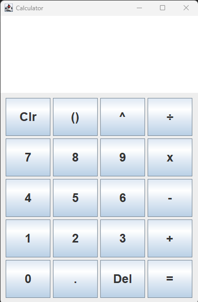
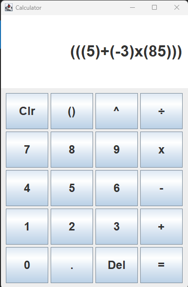
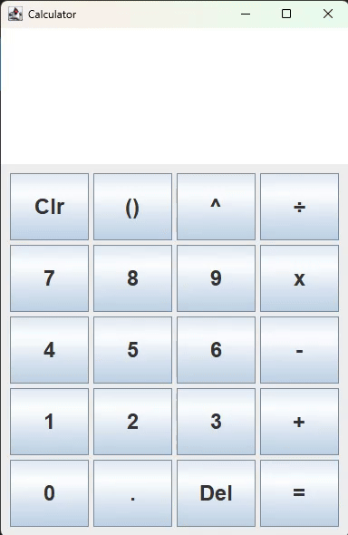

# Java Swing Calculator

A simple calculator application built with Java Swing.  
Supports addition, subtraction, multiplication, division, exponents, parentheses, and negative numbers.

## Features

- Addition, subtraction, multiplication, division, exponents
- Parentheses for grouping
- Negative numbers
- Error handling for invalid input and division by zero

> **Note:** Implicit multiplication (e.g., writing `2(3)` instead of `2x3` or `2x(3)`) is **not supported**. Always use the `x` button for multiplication.

## How to Run

1. Clone the repository:
   ```sh
   git clone https://github.com/Farag-Amr/Java-Projects.git
   ```
2. Open the project in your IDE
3. Compile and run `Calculator.java`.

## Screenshot




## Demo



[▶️ See Division By Zero Demo](Images/Division-By-Zero-Demo.gif)

[▶️ See Operator Logic Demo](Images/Operator-Logic.gif)

[▶️ Zero Handling Logic Demo](Images/Zero-Handling-Logic.gif)
