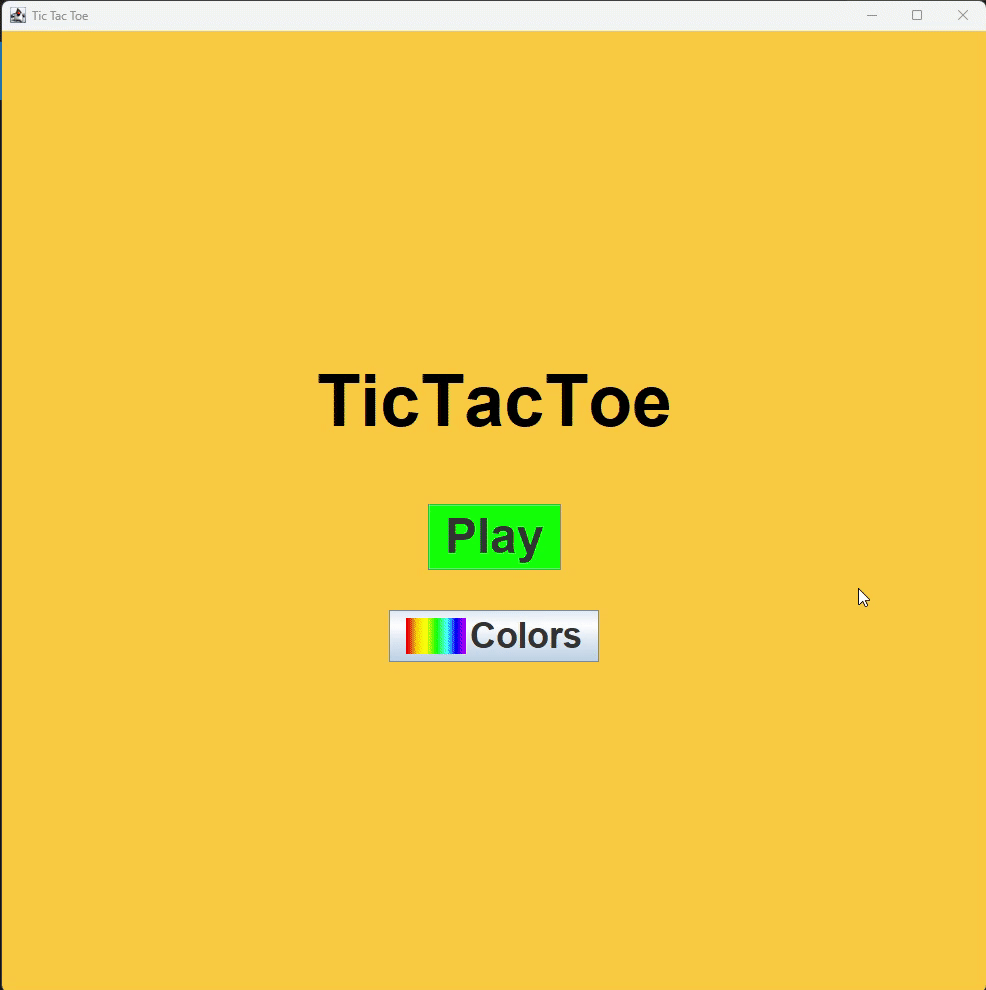
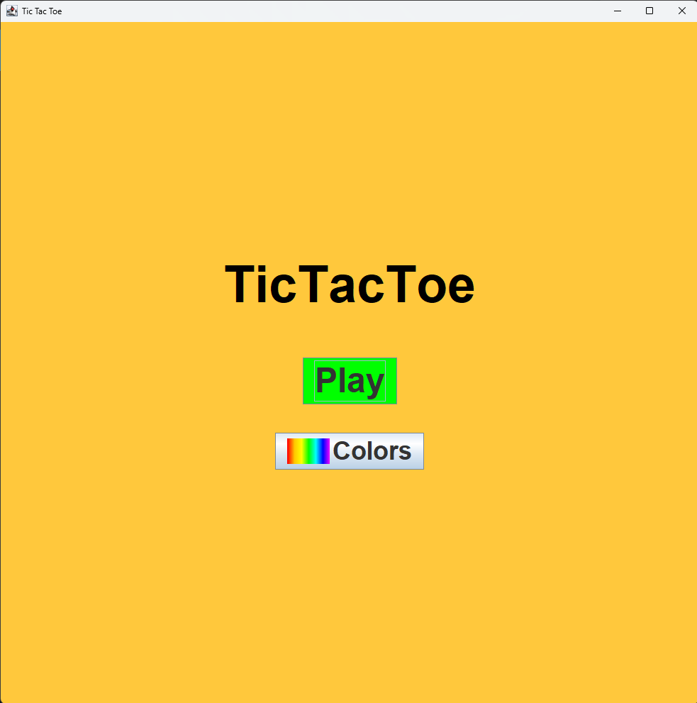
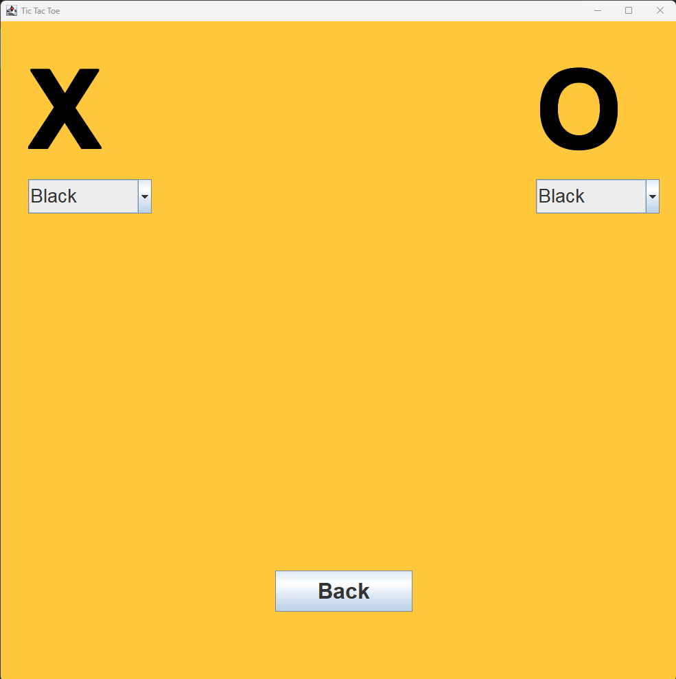
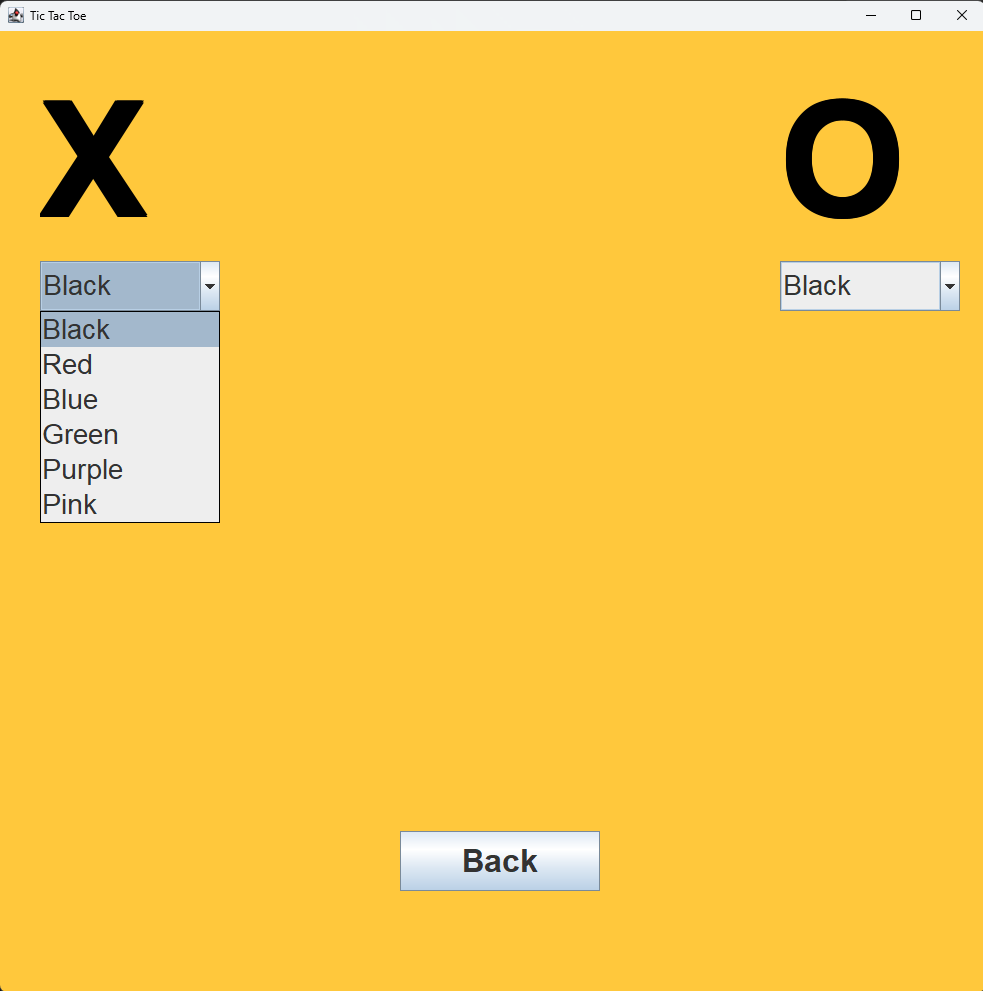
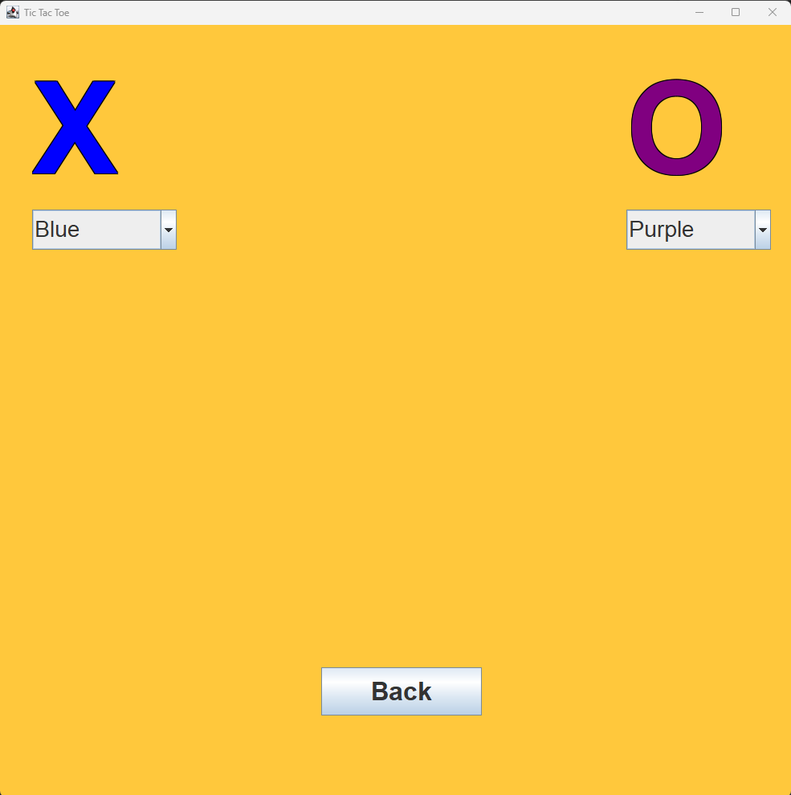
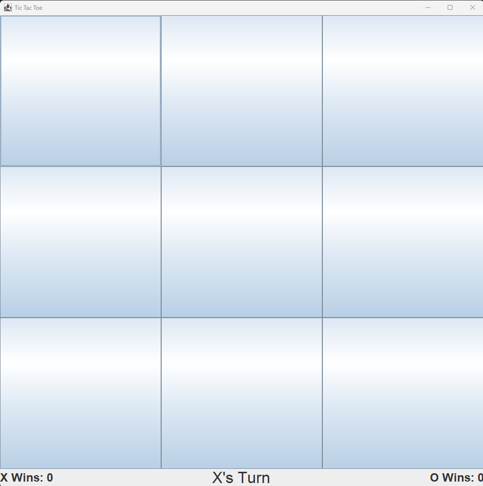
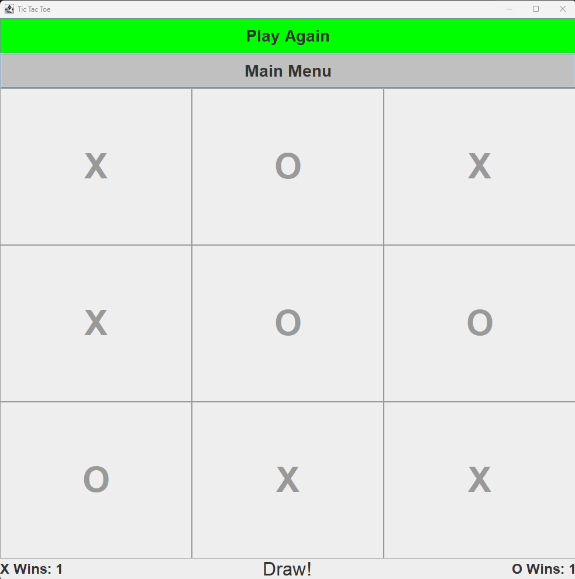
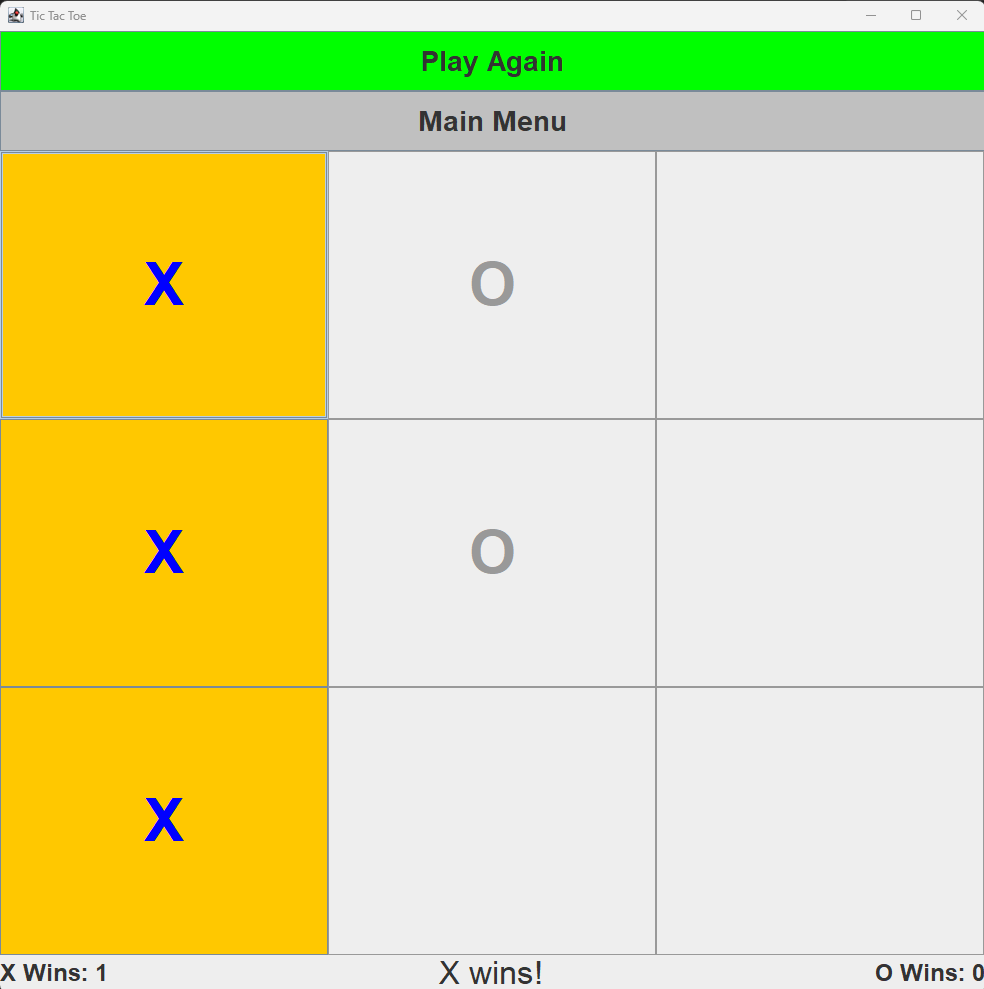
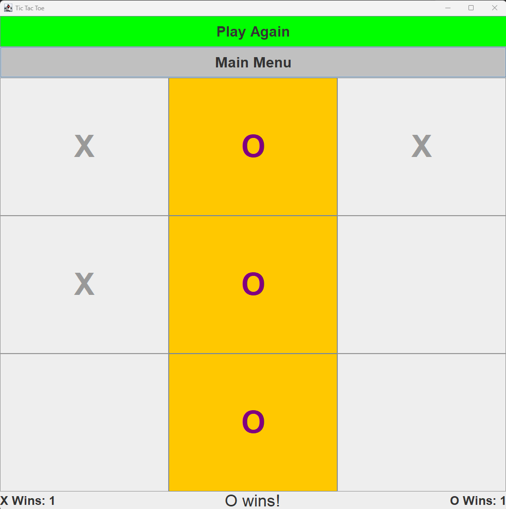

<h1>Java Swing Tic Tac Toe</h1>

A simple and colorful Tic Tac Toe game built with Java Swing.  
Features a main menu, customizable colors for X and O, and win counters.

<h2>Features</h2>

- Classic 3x3 Tic Tac Toe gameplay
- Main menu and color customization menu
- Choose from multiple colors for X and O
- Win counters for both players, displayed during play
- "Play Again" and "Main Menu" buttons after each game
- Highlights the winning combination
- Handles draws and disables the board when the game ends

<h2>How To Run</h2>

1. Clone the repository:
   ```sh
   git clone https://github.com/Farag-Amr/Java-Projects.git
   ```
2. Open the project in your IDE.
3. Compile and run `TicTacToe.java`.

<h3>Demo</h3>



<h2>Screenshots</h2>

<h3>Main Menu</h3>



<h3>Colors Menu</h3>



<p float="left" align="center">
  <figure style="display:inline-block; margin:10px;">
    
    <figcaption><b>Colors Options</b></figcaption>
  </figure>
  <figure style="display:inline-block; margin:10px;">
    
    <figcaption><b>Selected Colors</b></figcaption>
  </figure>
</p>

<h3>Game Board States</h3>

<p float="left" align="center">
  <figure style="display:inline-block; margin:10px;">
    
    <figcaption><b>Empty Game Board</b></figcaption>
  </figure>
  <figure style="display:inline-block; margin:10px;">
    
    <figcaption><b>Draw</b></figcaption>
  </figure>
</p>

<p float="left" align="center">
  <figure style="display:inline-block; margin:10px;">
    
    <figcaption><b>X Wins</b></figcaption>
  </figure>
  <figure style="display:inline-block; margin:10px;">
    
    <figcaption><b>O Wins</b></figcaption>
  </figure>
</p>

## Notes

- The game board and menus are fully resizable.
- Color choices are available for both X and O.
- Win counters persist until the application is closed or reset.
